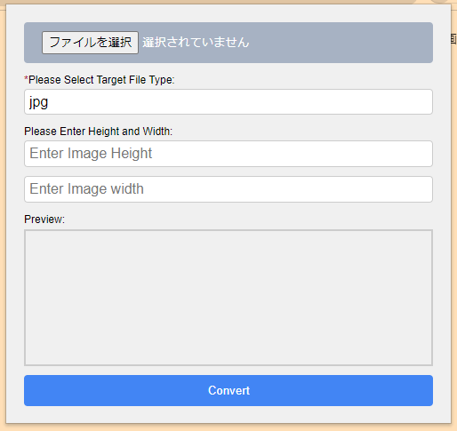

# chrome image converter

English | [日本語](./README_jp.md) | [简体中文](./README_zh.md)

# ✔ About

This is an extension tool for Chrome browser that converts image format and image size.

- Operation method

  

1. First, just select the target image.

2. Select the file type of the target.

3. Enter the height and width of the target image (optional).

4. Click the Convert button to convert the format and size of the image.

# ✔ About the author

- [Blog](https://seiri-blog.github.io)
- [Github](https://github.com/RyuSeiri)
- [Facebook](https://www.facebook.com/people/Ryu-Seiri/100087864783411)
- [Twitter](https://twitter.com/Seiriryu)
- [Qiita](https://qiita.com/Seiri)
- [BiliBili](https://space.bilibili.com/140506788)
- [YouTube](https://www.youtube.com/channel/UCph3vDUIHt68iR0vtHbChaw)
